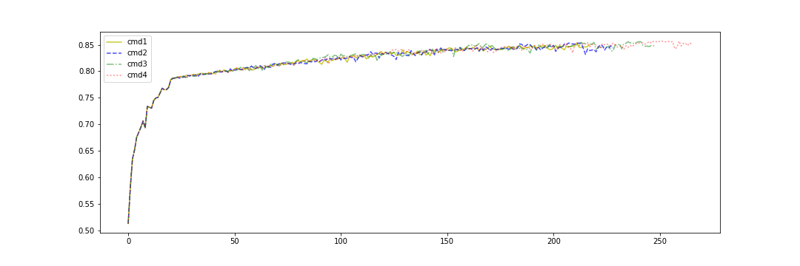
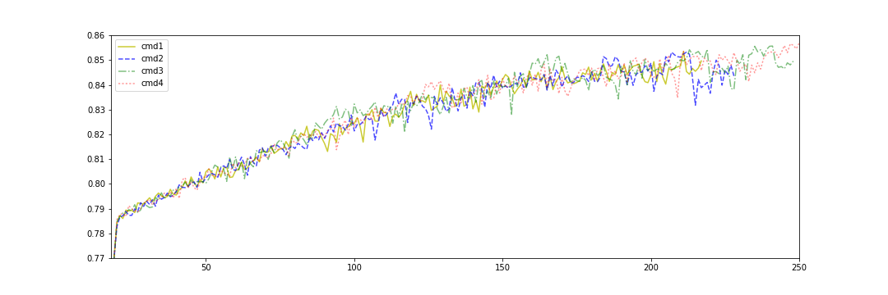
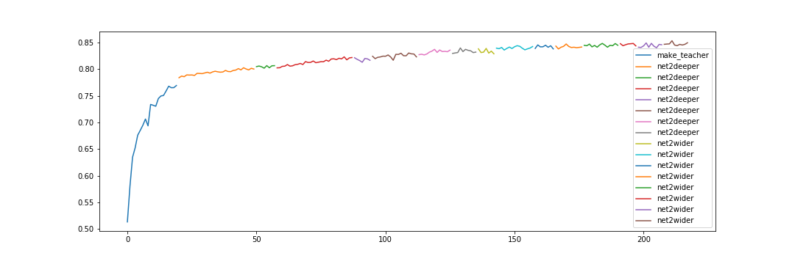

# NetworkCompress

Inspired by net2net, network distillation.

Contributor: @luzai, @miibotree

[TOC]

## Environment
- keras 2.0
- backend: tensorflow 1.1
- image_data_format: 'channel_last'

## TODO list:
@luzai  
- [ ] single model may be trained multiple time, have a nice event logger(csv or tfevents)
- [ ] logger for model mutations and training event
- [ ] Dataset swither(mnist, cifar100 or others)
- [x] test skip div 2 
- [x] write doc 
- [ ] more operation  

@miibotree
- [ ] Consider wider a layer whose successor is skip structure. 
- [ ] Weight intialization of skip. 
- [ ] The propobility of adding Maxpooling layer inversely propto depth (constrain the number of MaxPooling layers)
- [ ] The ratio of widening propto depth 
- [ ] Propobility of 5 mutation operations 
- [ ] group rand select in [1,2,4,8], initialize the weights.
- [ ] BN and ReLU
 
- [ ] wider_conv, deeper_conv
    - [ ] New compy weight method 'Resize3D'(numpy?)
    - [ ] Dropout
    - [ ] BN (principle?)
- [ ] skip
    - [ ] DAG and topological sort
- [ ] Distribute/ parallel Training
- [x] Mayavi
- [x] Summary at running time

- Use kd loss
  - [x] Train(65770): hard label + transfer label; Test(10000): cifar-10 hard label 
  - [x] use `functional API` rather than `sequence`
  - hard label + soft-target (tune hyper-parameter T)
- experiments on  comparing two type models: Final Accuracies are similar.
  - Deeper(Different orders) -> Wider: Accuracy grows stable; Train fast
  - Wider -> Deeper

- write `net2branch` function, imitating inception module
- net2deeper for pooling and dropout layer
- net2wider for conv layer on kernel size dimension, i.e., 3X3 to 5X5

## Finish list:

- Grow Architecture to VGG-like
    - [x] Exp: what accuracy can vgg-19 achieve
    - [x] Fixed: slight downgrade of net2wider conv8
    - [x] compare on accuracy and training time

|Vgg16|Vgg8|Vgg8+Dropout|Vgg8-net2net(no dropout)|
|--|--|---|---|
|10.00%|83.56%|90.05%|87.45%|

**Figure 1** Vgg8-net2net(no dropout, epoch 0-250)

**Figure 2** Vgg8-net2net(no dropout, epoch 20-250)

**Figure 3** Vgg-net2net(cmd1, in different stage)

- [x] kd loss
    -[x] soft-target
- [x] transfer data
- experiments on random generate model
  - [x] generate random feasible command 
  - [x] check the completeness, run code in parallel
  - [x] find some rules: Gradient explosion happens when fc is too deep
- [x] Data-augmentation is better than Dropout
