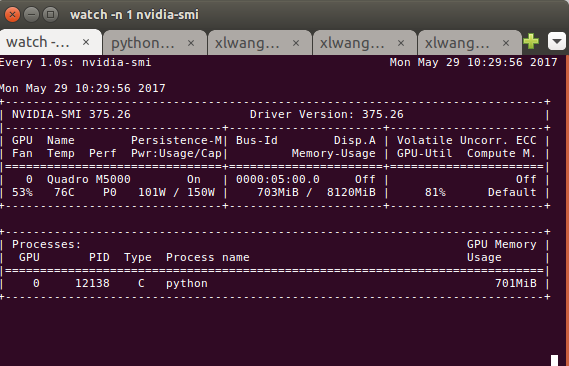
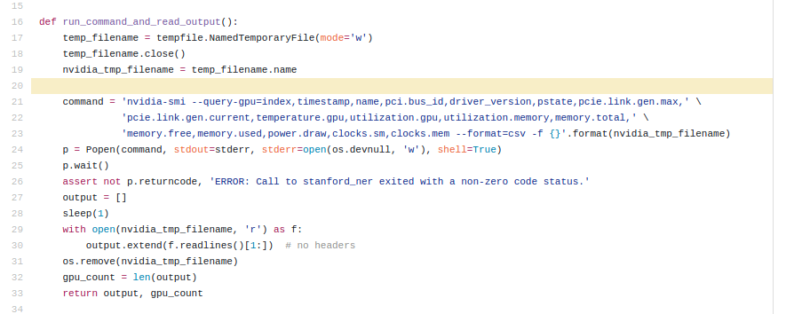

# Towards Model Parallel

## Mutation Operation

- Bug in Deeper Operation Fixed

| Before |  |
| ------ | ---------------------------------------- |
| After  |  |

- More tests on different mutation operation combination and order, we can see accuracy degradation of skip and pool operation. I think we should not stick to operation design, we can use refuse sampling technique, which is easy to implement when using multi processing.

## Multi Threading

- Implementation needs to override build-in `fit` function in keras, ref to https://github.com/luzai/NetworkCompress/blob/master/experiments/parallel.py
- The Running Pattern 

- Test speed

  | Number of Model | 1    | 3    | 5     | 10    | 30   |
  | --------------- | ---- | ---- | ----- | ----- | ---- |
  | Multi Thread    | 52   | 132  | 221   | 447   | 1426 |
  | Sequential      | 54   | 165  | 276   | 556   | 1732 |
  | Speedup         | 1    | 1.25 | 1.248 | 1.243 | 1.21 |

  

## Multi Process

### Toy Example: 

| Wall Time     |  |
| ------------- | ---------------------------------------- |
| Relative Time |                 |

### GA Example(Only deeper operation):

- Verify True Speedup!

- GPU Utilization Factor 

| Single Model |  |
| ------------ | ---------------------------------------- |
| Multi Model  |  |

## Other Tips:

- How to monitor GPU status to block training process:

